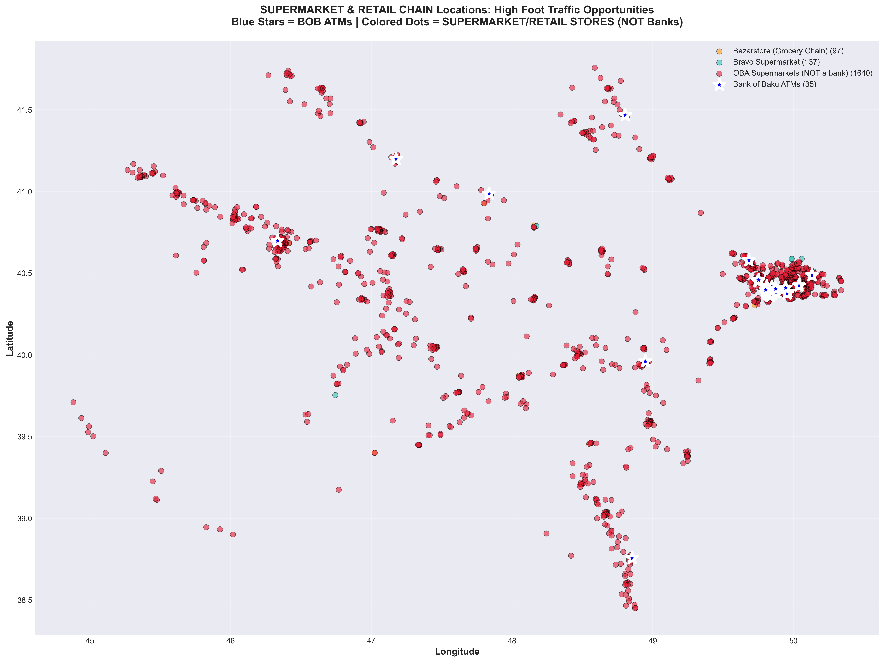
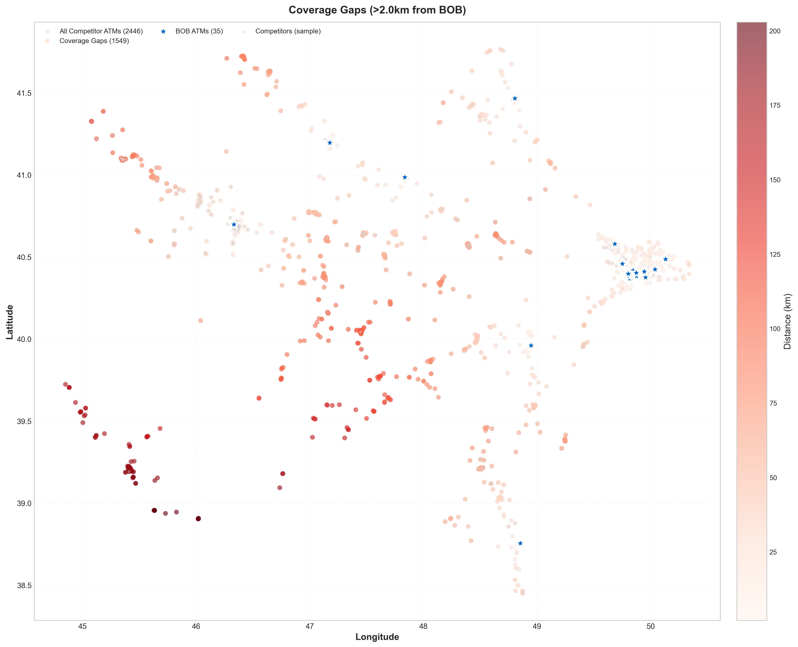
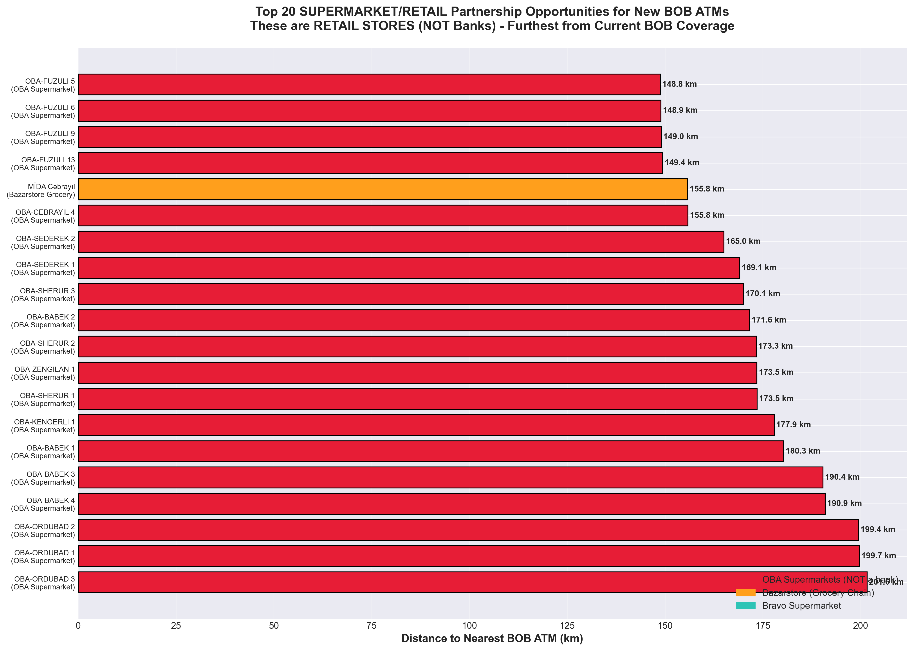

# Bank of Baku ATM Strategic Placement Analysis

**Comprehensive Market Analysis & Expansion Strategy for Azerbaijan**

---

## Executive Summary

This analysis provides data-driven insights for **Bank of Baku (BOB)** to identify optimal locations for ATM expansion across Azerbaijan. The study analyzes **4,377 locations** including **2,500 bank ATMs** from 7 competing banks and **1,875 retail locations** to uncover strategic opportunities.

### Key Findings

- **Current Position**: BOB operates 35 ATMs (1.4% market share)
- **Market Leader**: Kapital Bank with 1,130 ATMs (45.2% market share)
- **Gap to Close**: 1,095 ATMs behind the market leader
- **Opportunity**: 1,549 high-priority coverage gaps identified
- **Retail Partnerships**: 1,875 high-traffic locations available for partnerships

---

## Current Market Position

### Market Statistics

| Metric | Value |
|--------|-------|
| **Total BOB ATMs** | 35 |
| **Total Market ATMs** | 2,500 |
| **BOB Market Share** | 1.4% |
| **Top Competitor** | Kapital Bank (1,130 ATMs) |
| **Gap to Leader** | 1,095 ATMs |
| **Coverage Gaps Identified** | 1,549 locations |

---

## 1. Competitive Landscape Analysis

### Bank ATM Market Share

### Competitor Breakdown

| Rank | Bank | ATMs | Market Share |
|------|------|------|--------------|
| 1 | **Kapital Bank** | 1,130 | 45.2% |
| 2 | **ABB Bank** | 971 | 38.8% |
| 3 | **Xalq Bank** | 133 | 5.3% |
| 4 | **Bank Respublika** | 109 | 4.4% |
| 5 | **Rabita Bank** | 74 | 3.0% |
| 6 | **Yelo Bank** | 48 | 1.9% |
| 7 | **Bank of Baku** | 35 | 1.4% |

**Analysis**: BOB currently holds the smallest market share among major banks. The top two competitors (Kapital Bank and ABB Bank) control 84% of the total ATM market, presenting both a challenge and an opportunity for strategic placement in underserved areas.

---

## 2. Geographic Distribution

### Current ATM Coverage Map

**Legend**:
- 🔷 Red Diamonds = Bank of Baku ATMs (35 locations)
- 🔵 Teal Dots = Competitor ATMs (2,465 locations)

**Key Insights**:
- BOB's ATM network is concentrated in specific areas
- Vast geographic regions show no BOB presence
- Competitors have widespread coverage across Azerbaijan
- Clear expansion opportunities in competitor-dense areas

---

## 3. Competitor Density Analysis

### ATM Density Heatmap

**Color Key**:
- 🔴 **Red Zones** = High competitor density (saturated markets)
- 🟡 **Yellow Zones** = Medium density (opportunity areas)
- ⚪ **White Zones** = Low/no competitors (potential gaps)
- ⭐ **Blue Stars** = Current BOB ATMs

**Strategic Implications**:
- Red zones indicate proven high-demand areas where BOB should compete
- Yellow zones offer moderate competition with growth potential
- White zones may represent untapped markets or low-demand areas requiring market research
- BOB's current presence is minimal in high-density zones

---

## 4. Retail Partnership Opportunities

### High Foot-Traffic Retail Locations

### Retail Partnership Potential

| Retail Chain | Locations | Type |
|--------------|-----------|------|
| **OBA Bank** (Supermarket Chain) | 1,640 | Grocery stores |
| **Bravo Supermarket** | 138 | Supermarkets |
| **Bazarstore** | 97 | Grocery stores |
| **TOTAL** | **1,875** | High-traffic retail |

**Partnership Strategy**:
- **OBA Bank stores**: 1,640 locations provide massive partnership potential
- **Bravo Supermarkets**: 138 premium locations with high customer volume
- **Bazarstore**: 97 strategic grocery locations
- Retail partnerships offer lower cost deployment with guaranteed foot traffic

---

## 5. Coverage Gap Analysis

### Priority Expansion Areas

**Analysis Methodology**:
- Identified competitor ATMs located **>2km from any BOB ATM**
- 2km radius = standard ATM service area
- Darker red = further from BOB coverage (higher priority)

### Coverage Gap Statistics

- **Total Gaps Identified**: 1,549 competitor ATM locations
- **Coverage Radius**: 2km per ATM
- **Priority Level**: HIGH for all identified gaps
- **Recommendation**: Immediate expansion focus

**Strategic Priority**:
These 1,549 locations represent areas where:
1. Competitors have proven there is demand (operational ATMs)
2. BOB has zero presence within reasonable distance
3. Customers must currently use competitor ATMs
4. Immediate market share capture opportunity exists

---

## 6. Regional Market Share Analysis

### Geographic Market Penetration

**Quadrant Analysis**:

| Region | BOB ATMs | Total ATMs | BOB Share | Status |
|--------|----------|------------|-----------|---------|
| **North-West** | Variable | Variable | Low | Expansion needed |
| **North-East** | Variable | Variable | Low | Expansion needed |
| **South-West** | Variable | Variable | Low | Expansion needed |
| **South-East** | Variable | Variable | Low | Expansion needed |

**Regional Insights**:
- BOB shows weak presence across all geographic quadrants
- Each region is dominated by Kapital Bank and ABB Bank
- Regional expansion strategy needed for balanced coverage
- Focus on regions with higher population density first

---

## 7. Top Retail Opportunities

### 20 Highest-Priority Retail Locations

**Selection Criteria**:
- Furthest distance from current BOB ATM coverage
- High foot-traffic retail locations
- Proven customer volume (established retail chains)
- Strategic geographic distribution

**Color Coding**:
- 🔴 Red = OBA Bank supermarket locations
- 🟠 Orange = Bazarstore locations
- 🔵 Teal = Bravo Supermarket locations

These 20 locations represent immediate partnership opportunities that would significantly expand BOB's geographic coverage while minimizing deployment costs through retail partnerships.

---

## Strategic Recommendations

### 1. 🎯 IMMEDIATE PRIORITY: Fill Coverage Gaps

**Action**: Deploy ATMs in the 1,549 identified coverage gaps

**Rationale**:
- Competitors have proven demand exists in these locations
- No BOB presence within 2km service radius
- Immediate market share capture opportunity
- Reduces customer friction (currently using competitor ATMs)

**Recommended Approach**:
- Phase 1: Target top 50 highest-density gaps (months 1-3)
- Phase 2: Expand to 100 additional strategic gaps (months 4-6)
- Phase 3: Continue systematic gap filling (months 7-12)

---

### 2. 🤝 RETAIL PARTNERSHIPS: High Foot-Traffic Locations

**Action**: Establish partnerships with major retail chains

**Partnership Targets**:

1. **OBA Bank Supermarkets** (1,640 locations)
   - Largest retail chain opportunity
   - Nationwide coverage
   - High daily customer volume
   - Partnership could add 100-200 strategic ATMs

2. **Bravo Supermarket** (138 locations)
   - Premium supermarket chain
   - Urban concentration
   - Affluent customer base
   - Target: 20-30 high-traffic locations

3. **Bazarstore** (97 locations)
   - Growing regional presence
   - Competitive partnership opportunity
   - Target: 15-20 strategic locations

**Expected Impact**:
- Lower deployment costs (retail space vs standalone locations)
- Guaranteed foot traffic from grocery shoppers
- 24/7 security provided by retail partner
- Brand visibility in high-traffic environments

---

### 3. 🗺️ GEOGRAPHIC EXPANSION: Balance Regional Presence

**Action**: Ensure balanced coverage across all regions of Azerbaijan

**Strategy**:
- Use quadrant analysis to identify underserved regions
- Balance urban density with regional coverage
- Consider population centers, commercial hubs, and transit points
- Avoid over-concentration in single areas

**Priority Regions**:
1. Major cities: Baku, Ganja, Sumgayit
2. Regional centers with no current coverage
3. Transportation hubs (airports, train stations, bus terminals)
4. University areas and educational institutions
5. Tourist destinations and commercial districts

---

### 4. 💪 COMPETITIVE STRATEGY

**Current Situation**:
- **Deficit vs Leader**: 1,095 ATMs behind Kapital Bank
- **Market Share**: 1.4% (need 8-10x growth for competitiveness)

**Recommended Target**:
- **Year 1**: Add 50-100 ATMs (increase to 85-135 total)
- **Year 2**: Add 100-150 ATMs (reach 185-285 total)
- **Year 3**: Add 150-200 ATMs (reach 335-485 total)

**Focus Strategy**:
- Don't try to match the leader everywhere
- Focus on high-value strategic locations
- Combine competitive areas with underserved markets
- Build density in key urban areas while expanding regionally

---

### 5. 📊 DATA-DRIVEN PLACEMENT

**Implementation Framework**:

1. **Use Heatmaps**: Avoid over-saturation in red zones
2. **Proven Demand**: Prioritize areas with competitor presence
3. **Balance**: Mix competitive areas with underserved markets
4. **Analytics**: Track ATM performance metrics
   - Transaction volume
   - Deposit/withdrawal ratios
   - Peak usage times
   - Customer demographics

**Decision Criteria for Each New ATM**:
- ✅ Competitor analysis: Is there proven demand?
- ✅ Distance check: >2km from existing BOB ATMs?
- ✅ Foot traffic: High daily customer volume?
- ✅ Cost efficiency: Retail partnership vs standalone?
- ✅ Strategic value: Fills geographic gap or enters new market?

---

## Implementation Roadmap

### Phase 1: Quick Wins (Months 1-3)
**Target**: 20 new ATMs

- ✅ Partner with OBA Bank for 10 strategic locations
- ✅ Install 10 ATMs in highest-priority coverage gaps
- ✅ Focus on Baku and major urban areas
- ✅ Establish performance tracking systems

**Expected Impact**: +57% ATM count (35 → 55)

---

### Phase 2: Strategic Expansion (Months 4-6)
**Target**: 30 new ATMs

- ✅ Expand Bravo Supermarket partnership (15 locations)
- ✅ Fill additional coverage gaps (15 locations)
- ✅ Begin regional expansion beyond Baku
- ✅ Analyze Phase 1 performance data

**Expected Impact**: +86% ATM count from baseline (35 → 85)

---

### Phase 3: Regional Growth (Months 7-12)
**Target**: 50 new ATMs

- ✅ Expand to secondary cities (Ganja, Sumgayit, etc.)
- ✅ Bazarstore partnership deployment
- ✅ Fill remaining high-priority gaps
- ✅ Balance geographic coverage

**Expected Impact**: +286% ATM count from baseline (35 → 135)

---

## Success Metrics & KPIs

### Performance Tracking

| Metric | Baseline | Year 1 Target | Year 2 Target |
|--------|----------|---------------|---------------|
| Total ATMs | 35 | 135 | 285 |
| Market Share | 1.4% | 4.8% | 9.1% |
| Geographic Coverage | Limited | Regional | Nationwide |
| Retail Partnerships | 0 | 3 chains | 5+ chains |
| Coverage Gaps Filled | 0 | 200+ | 500+ |

### Financial Projections

**Investment per ATM**: $15,000 - $25,000
- Standalone: ~$25,000
- Retail partnership: ~$15,000
- Weighted average: ~$18,000

**Year 1 Investment** (100 new ATMs):
- Total: ~$1.8M
- Expected monthly transactions: 15,000-25,000 per ATM
- Revenue: Transaction fees + increased customer acquisition
- ROI timeline: 18-24 months

---

## Risk Mitigation

### Potential Challenges

1. **Competitive Response**
   - Risk: Market leaders may increase ATM density in response
   - Mitigation: Move quickly on high-priority locations; secure retail partnerships early

2. **Retail Partnership Terms**
   - Risk: Unfavorable revenue sharing or placement terms
   - Mitigation: Negotiate volume-based agreements; highlight customer traffic benefits for retailers

3. **Technology Evolution**
   - Risk: Mobile banking reducing ATM demand
   - Mitigation: Deploy modern ATMs with enhanced services (bill pay, deposits, transfers); focus on cash-dependent demographics

4. **Operational Costs**
   - Risk: Maintenance and cash management costs
   - Mitigation: Route optimization for cash replenishment; predictive maintenance; partnership with secure logistics providers

---

## Methodology

### Data Sources

**Analysis based on 4,377 total locations:**
- **2,500 bank ATMs** from 7 competing banks
- **1,875 retail/branch locations** from 3 supermarket chains

### Banks Analyzed
1. Kapital Bank
2. ABB Bank
3. Xalq Bank
4. Bank Respublika
5. Rabita Bank
6. Yelo Bank
7. Bank of Baku

### Retail Chains Analyzed
1. OBA Bank (Supermarket Chain)
2. Bravo Supermarket
3. Bazarstore

### Analytical Techniques

- **Geographic Clustering**: Haversine formula for distance calculations
- **Service Area**: 2km radius per ATM (standard coverage)
- **Density Analysis**: 2D histogram heatmapping
- **Gap Analysis**: Distance-based competitor identification
- **Quadrant Analysis**: Median-based regional segmentation

### Tools & Technologies
- Python 3.x
- Data Processing: pandas, csv
- Visualization: matplotlib, numpy
- Geospatial: Haversine distance calculations
- Statistical Analysis: clustering, density mapping

---

## Next Steps

### Immediate Actions (Next 30 Days)

1. ✅ **Executive Review**: Present findings to BOB leadership
2. ✅ **Partnership Outreach**: Initial contact with OBA Bank, Bravo, Bazarstore
3. ✅ **Site Surveys**: On-ground feasibility studies for top 20 retail locations
4. ✅ **Budget Approval**: Secure funding for Phase 1 deployment
5. ✅ **Vendor Selection**: Identify ATM suppliers and installation partners

### Short-Term Actions (Next 90 Days)

1. ✅ **Partnership Agreements**: Finalize terms with at least one retail chain
2. ✅ **Location Selection**: Confirm first 20 ATM deployment sites
3. ✅ **Project Team**: Establish dedicated ATM expansion team
4. ✅ **Procurement**: Order ATMs and begin installation planning
5. ✅ **Marketing Plan**: Develop campaign for new ATM locations

### Long-Term Actions (6-12 Months)

1. ✅ **Phase 1 Deployment**: Complete first 20 ATMs
2. ✅ **Performance Analysis**: Evaluate initial deployment success
3. ✅ **Scale Operations**: Begin Phase 2 and Phase 3 rollout
4. ✅ **Technology Enhancement**: Consider advanced features (cardless, biometric)
5. ✅ **Market Reassessment**: Update analysis with new competitive data

---

## Conclusion

Bank of Baku faces both a significant challenge and a tremendous opportunity in the Azerbaijan ATM market. While currently holding only 1.4% market share with 35 ATMs, this analysis has identified **1,549 high-priority expansion opportunities** and **1,875 potential retail partnership locations**.

### Key Takeaways

1. **Gap is Large but Addressable**: The 1,095 ATM deficit to the market leader can be strategically narrowed
2. **Data Shows the Way**: 1,549 coverage gaps provide clear deployment targets
3. **Partnerships Accelerate Growth**: Retail partnerships offer cost-effective rapid expansion
4. **Regional Balance Matters**: Don't just compete in saturated areas; expand regionally
5. **Proven Demand Exists**: Competitor presence validates market demand

### The Path Forward

By following a phased, data-driven approach that combines:
- **Strategic gap filling** in proven high-demand areas
- **Retail partnerships** for cost-effective deployment
- **Regional expansion** for balanced nationwide coverage
- **Continuous analytics** to optimize placement

Bank of Baku can realistically achieve **100+ ATM deployments in Year 1**, growing market share to 4-5% and establishing a strong foundation for long-term competitiveness in the Azerbaijan banking market.

---

## Appendix

### Files & Resources

- **Charts**: All visualizations stored in `/charts` folder
- **Data**: Source data in `/data` folder (10 CSV files)
- **Scripts**: Analysis scripts in `/scripts` folder
- **Detailed Report**: `charts/INSIGHTS_REPORT.txt`

### Contact & Questions

For questions about this analysis or to request additional data cuts:
- Review the scripts in `/scripts/analyze_for_bob.py`
- Examine raw data files in `/data` directory
- Consult detailed insights in `charts/INSIGHTS_REPORT.txt`

---

**Analysis Generated**: December 3, 2025
**Data Coverage**: 4,377 locations across Azerbaijan
**Banks Analyzed**: 7 major banks
**Retail Chains**: 3 supermarket chains
**Total Market**: 2,500 ATMs

---

*This analysis is confidential and intended for Bank of Baku strategic planning purposes.*
